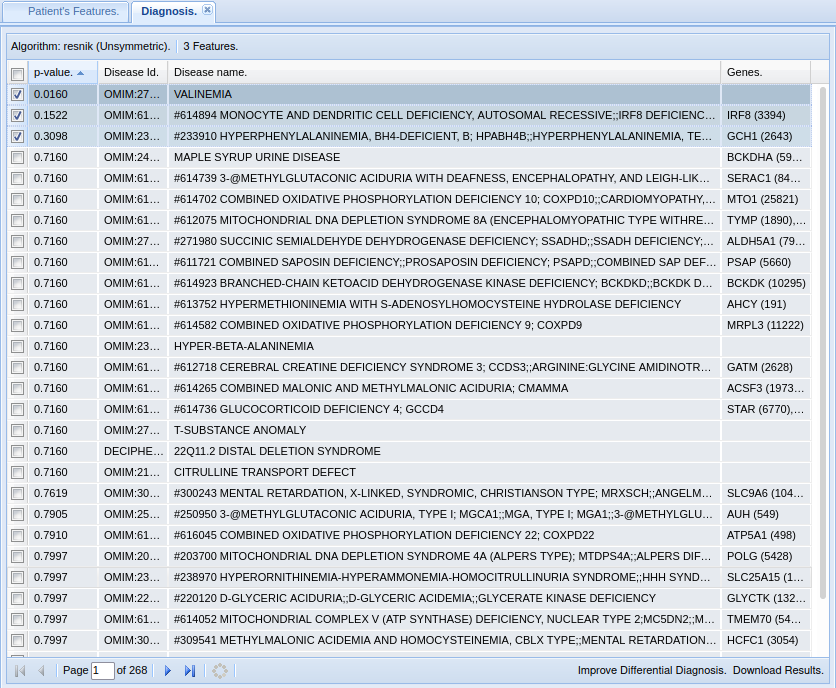

.. _rstphenomizeranswers:

###############################
Phenomizer: Hints and Solutions
###############################

Exercise 1: Solution
^^^^^^^^^^^^^^^^^^^^

The top diagnosis is `Valinemia <https://hpo.jax.org/app/browse/disease/OMIM:277100>`_ (Corresponding `OMIM entry <https://omim.org/entry/277100>`_).
The figure shows the differential diagnosis window of Phenomizer.

The p-value for Valinemia is 0.0160.  We suggest that a "significant" p-value be interpreted to mean that there is sufficient evidence of a good phenotypic match as to 
suggest further consideration. On the other hand, if the top hit does not have a signficant p-value, this can reflect the fact that the clinical findings are not 
specific enough, per se, to allow a diagnosis. The physician can now use the Phenomizer to generate a list of clinical features that are most 
specific for individual diagnoses in a set of selected syndromes and can use this list to guide the further workup. 

Exercise 2: Solution
^^^^^^^^^^^^^^^^^^^^

There is no correct answer for this exercise. Instead, we hope that you have gotten a sense for how adding HPO terms to the list of observed terms changes the differential diangosis. 
Although details will vary, all HPO-based tools we are aware of are sensitive in this way to the input terms - it is important to provide a comprehensive list of terms thatreflect the phenotypic abnormalities in a patient in detail.
