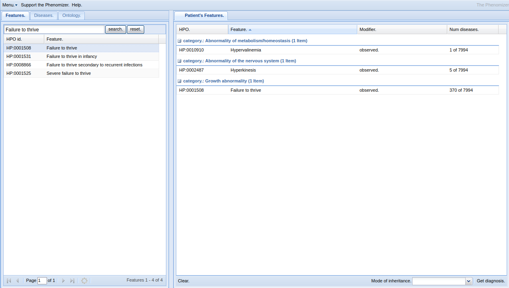

.. _rstphenomizer:

##########
Phenomizer
##########

The `Phenomizer <http://compbio.charite.de/phenomizer/>`_ is a web-based application that provides clues to the differential diangosis of 
an individual with suspected rare disease based on the observed phenotypic abnormalities.

* Köhler S et al (2009) Clinical diagnostics in human genetics with semantic similarity searches in ontologies. Am J Hum Genet;85(4):457-64 [`PMID:19800049 <https://pubmed.ncbi.nlm.nih.gov/19800049/>`_]

The differential diagnostic process attempts to identify candidate diseases that best explain a set of clinical features. 
This process can be complicated by the fact that the features can have varying degrees of specificity, as well as by the presence 
of features unrelated to the disease itself. Depending on the experience of the physician and the availability of laboratory tests, 
clinical abnormalities may be described in greater or lesser detail. We have adapted semantic similarity metrics to measure phenotypic 
similarity between queries and hereditary diseases annotated with the use of the Human Phenotype Ontology (HPO) and have developed a 
statistical model to assign p values to the resulting similarity scores, which can be used to rank the candidate diseases. 

The Phenomizer has a short manual that can be downloaded from the ``help`` menu of the `Phenomizer <http://compbio.charite.de/phenomizer/>`_ web application.
Before doing the exercise, read the manual to familiarize yourself with the application.

Exercise 1
##########

We will use the Phenomizer to search for the correct diagnosis of an individual observed to have the following phenotypic features

* Valinuria
* Hyperkinesis
* Failure to thrive

Enter these terms in the Phenomizer (the easiest way is to copy the terms from this webpage and paste them into the autocomplete field of Phenomizer.
The app will ask you if you would like to use symmetric mode (click yes; details about this are in the paper cited above). You should now see something like the following.

Now click on the ``Get diagnosis`` button and examine the differential diagnosis window.

What is the top candidate proposed by Phenomizer? Why? 

Exercise 2
##########

In some cases, the initial workup of a patient may not provide sufficient detail to guide the differential diagnosis. Let us simulate this sitation
by entering only the following two terms into a new Phenomizer session.

* Multiple cafe-au-lait spots
* Scoliosis

If we click on the ``Get diagnosis`` button and examine the differential diagnosis window, we will see that none of the proposed differential diagnoses is significant.
There are many ways to use Phenomizer to narrow down the differential diagnosis. Let us imagine we have examined a child with neurofibromatosis type 1, but are unaware of the diagnosis.
In principle, we might use tools such as Phenomizer to find phenotypic abnormalities, which, if present, would most improve the differential diagnosis. 
This works because in the current list, there are many diagnoses with the same relatively unspecific match. If we can identify one more HPO terms in our patient that is 
specific for one or other disease, then the diagnosis should move to the top of the list. The manual of the Phenomizer describes the two search modes - binary and specific.

We suggest that you add the specific additional term `Axillary freckling <https://hpo.jax.org/app/browse/term/HP:0000997>`_. If you would like to work more on this example,
you might want to consult the `diagnostic criteria for NF1 and Legius syndrome <https://www.nature.com/articles/s41436-021-01170-5>`_ to find additional appropriate terms.

Wrap-up
#######

In this module, you have gotten familiar with the Phenomizer and the basics of HPO-based semantic similarity analysis for differential 
diagnostic support.. 

If you had trouble with any of the exercises, see :ref:`rstphenomizeranswers`.