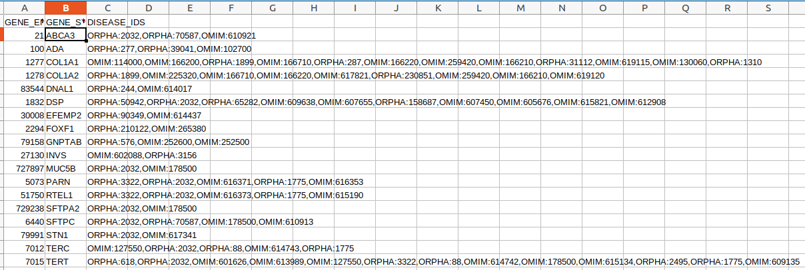
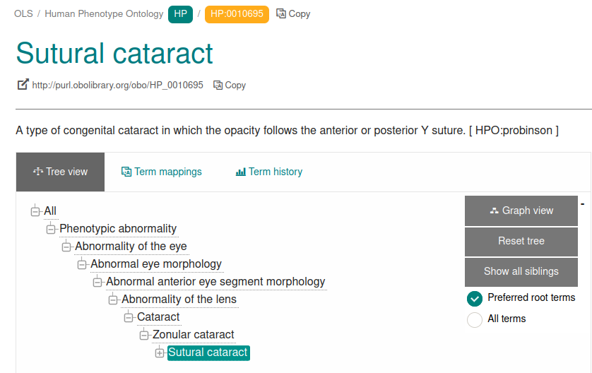

.. _rstwebsiteanswers:

###############################################
Navigating the HPO Website: Hints and Solutions
###############################################

Exercise 1: Solution
^^^^^^^^^^^^^^^^^^^^

To determine how many genes are associated with `Pulmonary insufficiency <https://hpo.jax.org/app/browse/term/HP:0010444>`_, click on the
``Export associations`` button to download an Excel file with the genes. You should see an Excel file similar to the following.

Thus, at the time of this writing there were 18 genes associated with `Pulmonary insufficiency <https://hpo.jax.org/app/browse/term/HP:0010444>`_.

Exercise 2: Solution
^^^^^^^^^^^^^^^^^^^^

The easiest way to determine the number of links between `Sutural cataract <https://hpo.jax.org/app/browse/term/HP:0010695>`_. and 
`Phenotypic abnormality <https://hpo.jax.org/app/browse/term/HP:0000118>`_ is to go to the corresponding page at OLS and count the links.

Thus, there are 7 links between `Sutural cataract <https://hpo.jax.org/app/browse/term/HP:0010695>`_. and 
`Phenotypic abnormality <https://hpo.jax.org/app/browse/term/HP:0000118>`_ . We say that the ``depth`` of 
`Sutural cataract <https://hpo.jax.org/app/browse/term/HP:0010695>`_ is 7.