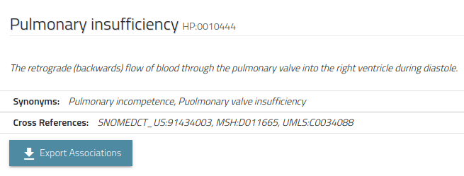
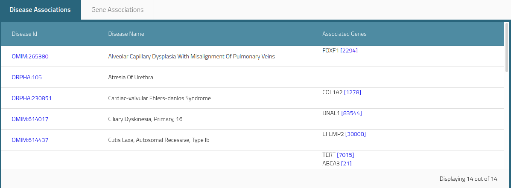
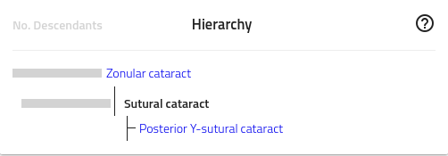

.. _rstwebsite:

##########################
Navigating the HPO Website
##########################

This page contains a series of exercises that illustrate how to find information on the HPO Website.

The basics
^^^^^^^^^^

Go to the `start page <https://hpo.jax.org/app/>`_ of the HPO site. You will find a search box that offers autocomplete functionality.

You can search for HPO terms, diseases, and genes. Let's start by searching for *Pulmonary insufficiency*. Enter it in the search window and click on the link.
You should get to the page for `Pulmonary insufficiency <https://hpo.jax.org/app/browse/term/HP:0010444>`_.

The page offers several components. The core information about the term is shown in this box.

We see the primary identifier of the term (HP:0010444), the prefered label (Pulmonary insufficiency), a definition, and a list of synonyms (Synonyms are useful to help find terms and to support text mining).

Most HPO terms are used to annotate one or more diseases. In this case, Pulmonary insufficiency is used to annotate a number of diseases that are shown in 
the Disease Associations tab.

The Gene associations tab shows the genes that are associated with these diseases. 

Exercise 1
##########

Determine how many genes are associated with pulmonary insufficiency in the HPO data resource. Note that by associated we mean that if 
a pathogenic variant in a gene causes a Mendelian disease, one of whose manifestations is *pulmonary insufficiency*, then we regard the 
gene as being associated with this phenotypic feature.

There are two ways of answering this question. (1) The Gene tab has a list of associated genes. (2) You can click on the ``Export associations`` button
shown above to download an Excel file with the genes. For this exercise, download the excel file.

The HPO hierarchy
#################

Each term in the HPO describes a phenotypic abnormality, such as Atrial septum defect. Terms are related to parent terms by "is a" relationships. 
The structure of the HPO, which allows a term to have multiple parent terms, 
enables different aspects of phenotypic abnormalities to be explored. The true-path rule
applies to the terms of the HPO. That is, if an individual has `Sutural cataract <https://hpo.jax.org/app/browse/term/HP:0010695>`_, the individual
can also be said to have the parent term of Sutural cataract, `Zonular cataract <https://hpo.jax.org/app/browse/term/HP:0010920>`_, as well as the
grand-parent term of Sutural cataract, `Cataract <https://hpo.jax.org/app/browse/term/HP:0000518>`_. 

Medically, this is true, because a Sutural cataract is defined as 

  A cataract that affects the region of the lens directly beneath the capsule of the lens.

Since a Zonular cataract is defined as a cataract that affects a specific region (zone) of the lens, this is clearly true. It is also clear that both
Sutural cataract and zonular cataract are specific kinds of cataract. The HPO is constructed to capture medical knowledge in this way. It is therefore important for users
to know how to navegate the hierarchy of the HPO. We will do so in the following exercise.

Exercise 2
##########

For this exercise, you are asked to determine the number of links (hops) from `Sutural cataract <https://hpo.jax.org/app/browse/term/HP:0010695>`_ to the
root of the phenotypic abnormality section of the HPO, `Phenotypic abnormality <https://hpo.jax.org/app/browse/term/HP:0000118>`_. The latter term is the
parent to all pghenotypic abnormalities. Please take a few minutes to explore the children of this term in order to get a sense of the breadth of the HPO.

To calculate the number of links, note that there is one link between `Sutural cataract <https://hpo.jax.org/app/browse/term/HP:0010695>`_  and 
`Zonular cataract <https://hpo.jax.org/app/browse/term/HP:0010920>`_. This can be seen in the correspond part of the page for sutural cataract.

Each term page of the HPO shows an excerpt of the entire hierarchy.  The gray bar to the left of the terms in this view will show the number of descendent
terms if you hover the mouse over the bar. For instance, `Sutural cataract <https://hpo.jax.org/app/browse/term/HP:0010695>`_  contains a single descendent
term, `Posterior Y-sutural cataract <https://hpo.jax.org/app/browse/term/HP:0008031>`_, while `Zonular cataract <https://hpo.jax.org/app/browse/term/HP:0010920>`_
has a total of 21 descendents (including Sutural cataract).

You can navigate from a term to its parent term using the links in this box, and can continue to do so until you have reached
`Phenotypic abnormality <https://hpo.jax.org/app/browse/term/HP:0000118>`_. The number of clicks will equal the number of links between 
`Sutural cataract <https://hpo.jax.org/app/browse/term/HP:0010695>`_  and `Phenotypic abnormality <https://hpo.jax.org/app/browse/term/HP:0000118>`_, 
i.e., the ``depth`` of the term `Sutural cataract <https://hpo.jax.org/app/browse/term/HP:0010695>`_.

The HPO website chooses to show only an excerpt of the hierarchy for simplicity's sake. Other ontology browsers show the entire path from the selected term to the root.
We recommend the  Ontology Lookup Service (OLS) of the European Bioinformatics Institute (EBI). Here is a link to the OLS page  for 
`Sutural cataract <https://www.ebi.ac.uk/ols/ontologies/hp/terms?iri=http%3A%2F%2Fpurl.obolibrary.org%2Fobo%2FHP_0010695>`_, which allows you to count the 
number of links directly.

Wrap-up
#######

In this module, you should have learned to recognize the basic elements of an HPO term (id, label, definition, and in many cases comment, synonyms, and cross references).
You should now be able to search for HPO terms using the HPO webpage, how to determine how many diseases and genes are associated with 
a term, and how to navigate the hierarchy of the HPO to determine a term's depth in the ontology. 

If you had trouble with any of the exercises, see :ref:`rstwebsiteanswers`.

