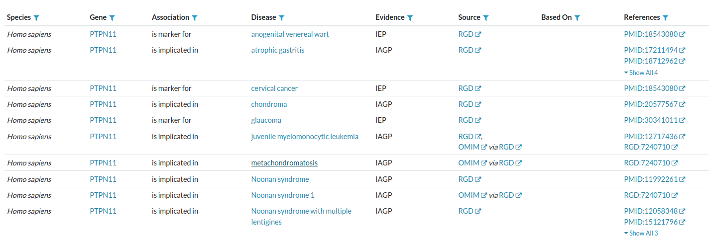
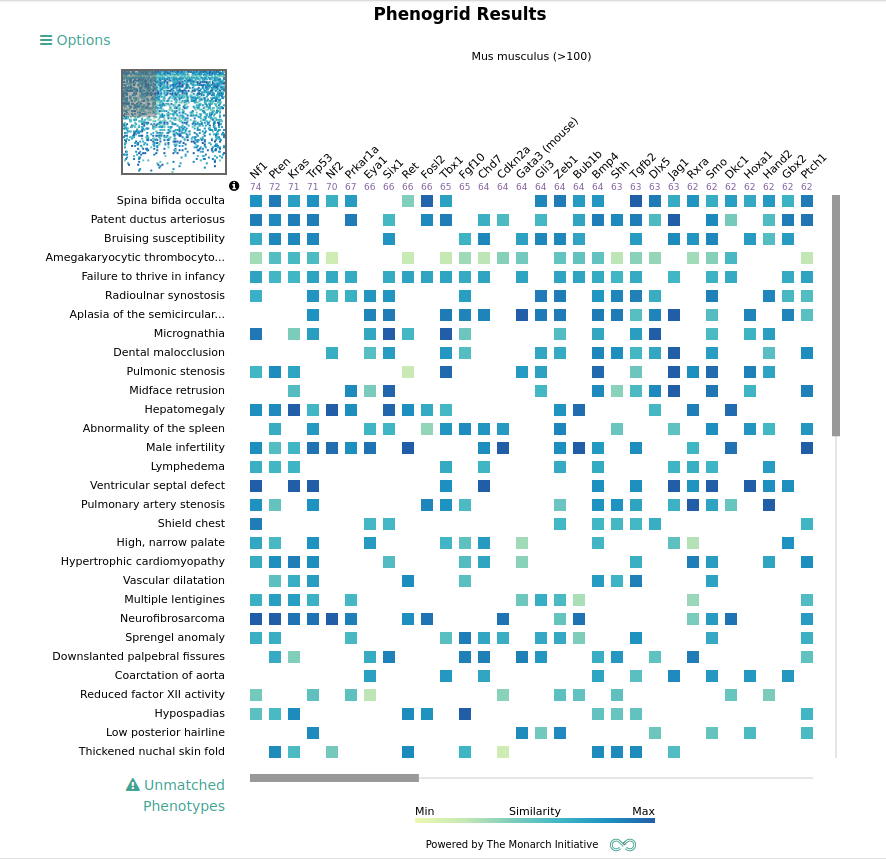

.. _rstxspeciesanswers:

##########################################################
Human, Mouse & Cross-Species Comparison: Hints and Answers
##########################################################

Exercise 1: Solution
^^^^^^^^^^^^^^^^^^^^

This may seem to be a trivial assignment because you can go the AGR website and find there are 26 diseases listed with an association to *PTPN11* (the figure shows the first 10):

However, let's take a closer look. Examine the ``Association`` column. Mutations in *PTPN11* cause Noonan syndrome type 1, and this is the best known 
disease association for the gene. This is shown on line 9 of the figure with the association ``is implicated in``.  If we consult OMIM, we find that Mutationsin *PTPN11* are also causal for three 
other Mendelian diseases (`OMIM:176876 <https://www.omim.org/entry/176876>`_). We additionally see entries that specify *PTPN11* as a ``marker`` for other diseases 
including anogenital venereal wart, cervical cancer, and glaucoma. We additionally see that *PTPN11*  ``is implicated in`` glaucoma, but when we consult
the cited article, we find that the gene is not mutated in glaucoma in a Mendelian sense.  Additionally, *PTPN11* is shown as being linked to 
*Noonan syndrome with multiple lentigines*, but when we consult the article, we find that this is actually a synonym for `LEOPARD syndrome 1 <https://www.omim.org/entry/151100>`_, 
rather than a distinct disease. 

So, it actually takes effort, experience, and some domain expertise to answer this question.

Exercise 2: Solution
^^^^^^^^^^^^^^^^^^^^

This exercise aimed to familiarize you with the Monarch Initiative's Phenogrid tool. There are many options. The path laid out in the instructions 
will create a grid that looks like this.

We see that the top phenotypic similarity in the mouse is actually to a model with a knockout in the *Nf1*. This is interesting because both genes operation in the RAS pathway and both
Noonan syndrome and neurofibromatosis type 1 are Rasopathies.

We encourage you to explore the Phenogrid with a gene or disease that is of interest for your research!

