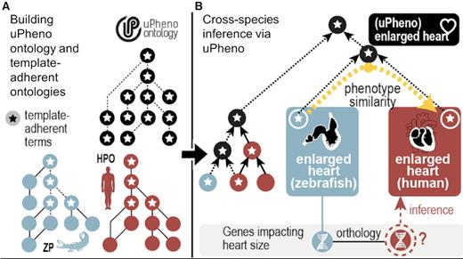

.. _rstxspecies:

#######################################
Human, Mouse & Cross-Species Comparison
#######################################

The use of model organisms as tools for the investigation of human genetic variation has significantly and rapidly advanced our understanding of the aetiologies underlying hereditary traits. However, while equivalences in the DNA sequence of two species may be readily inferred through evolutionary models, the identification of equivalence in the phenotypic consequences resulting from comparable genetic variation is far from straightforward,

There are three major methodologies to identify phenotypes in the mouse that are relevant to a human disease (Robinson PN, Webber C, `PMID:24699242 <https://pubmed.ncbi.nlm.nih.gov/24699242>`_). 

* **(A)** Classical approach. A mouse model is made or identified that possesses a genotype equivalent to a penetrant mutation that in human underlies the disease of interest (termed construct validity). The mouse model is examined for phenotypes that resemble those that define the human disorder (face validity). 
* **(B)** Phenolog mapping. A group is formed containing candidate genes for a disease of interest. The respective mouse  models for the orthologues of these genes are then examined for any unusually overrepresented phenotypes among them and these phenotypes (termed phenologs) are deemed relevant to the disease. 
* **(C)** Direct phenotype mapping. Given the phenotype(s) that describe a human disease, the corresponding phenotypes in mouse are inferred by means of computational reasoning using interspecies phenotype ontology analysis. In the example shown, the HPO term `Aortic stenosis <https://hpo.jax.org/app/browse/term/HP:0001650>`_ is defined on the basis of the PATO term `constricted <https://www.ebi.ac.uk/ols/ontologies/pato/terms?iri=http%3A%2F%2Fpurl.obolibrary.org%2Fobo%2FPATO_0001847>`_ and `aortic valve <https://www.ebi.ac.uk/ols/ontologies/uberon/terms?iri=http%3A%2F%2Fpurl.obolibrary.org%2Fobo%2FUBERON_0002137>`_  from the cross-species anatomy ontology UBERON. Similarly, the MPO term `aortic valve stenosis <http://www.informatics.jax.org/vocab/mp_ontology/MP:0006117>`_ is defined using the same PATO term constricted and aortic valve. Automatic reasoning therefore places the HPO term Aortic stenosis and the MPO term aortic valve stenosis in the direct vicinity of one another in a cross-species phenotype ontology.

Monarch-Initiative
##################

s. The `Monarch Initiative <https://monarchinitiative.org>`_ integrates information on genes, variants, genotypes, phenotypes and diseases in a variety of species, and allows powerful ontology-based search.  
[Shefchek KA, et al, Nucleic Acids Res. 2020  `PMID:31701156 <https://pubmed.ncbi.nlm.nih.gov/31701156/>`_]. In this exercise, we will explore how to 
use the Monarch Web app to explore the cross-species inference algorithms that are used in the Exomiser tool. The following Figure summarizes the 
cross species-matching approach'; for more details, please consult the Shefchek et al. paper.

  Computable definitions specified using uPheno templates are used to automate classification of uPheno and parts of the Zebrafish Phenotype Ontology (ZP (13); dashed lines). (B). Computable definitions also drive automated classification of HPO and ZP classes under uPheno classes. For example, enlarged heart in ZP (defined using the zebrafish anatomy heart term) and enlarged heart in HPO are both classified under uPheno enlarged heart (defined using Uberon heart). Algorithms can use this classification under uPheno to predict that human orthologs of zebrafish genes annotated to enlarged heart may cause enlarged heart in humans.
  uPheno template-driven ontology development and harmonization. uPheno templates are used to define phenotypes according to agreed upon design patterns. (A). Computable definitions specified using uPheno templates are used to automate classification of uPheno and parts of the Zebrafish Phenotype Ontology (ZP (13); dashed lines). (B). Computable definitions also drive automated classification of HPO and ZP classes under uPheno classes. For example, enlarged heart in ZP (defined using the zebrafish anatomy heart term) and enlarged heart in HPO are both classified under uPheno enlarged heart (defined using Uberon heart). Algorithms can use this classification under uPheno to predict that human orthologs of zebrafish genes annotated to enlarged heart may cause enlarged heart in humans.
  
Exercise 1
^^^^^^^^^^

The Alliance of Genome Resources (AGR) is a consortium of the major model organism databases [`PMID:31552413 <https://pubmed.ncbi.nlm.nih.gov/31552413/>`_]. 
The AGR and Monarch Initiative websites offer good portals for exploring cross-species phenotype data. For these exercises, we will explore the 
AGR pages related to `Noonan syndrome 1 <https://omim.org/entry/163950>`_, which is caused by deleterious variants in the *PTPN11* gene.

Go to the corresponding `PTPN11 page <https://www.alliancegenome.org/gene/HGNC:9644>`_. Answer the following questions

* How many human diseases are associated with mutation in *PTPN11*? (Feel free to work with another gene of your choice).

Exercise 2
^^^^^^^^^^

* What are some phenotypic categories that are abnormal in human and mouse?

For this, let's use the Phenogrid tool of the Monarch Initiative.

1. Open the Phenogrid entry page: https://monarchinitiative.org/analyze/phenotypes
2. Click, "No, I'll need some help"
3. Click "Generate a list from a gene"
4. Enter *PTPN11* (human)
5. Click "Compare profile" (at bottom of page)
6. Click "Show me everything"
7. Click taxon mouse

Wrap-up
#######

In this module, you have learned to search for cross-species phenotype data.

If you had trouble with any of the exercises, see :ref:`rstxspeciesanswers`.
